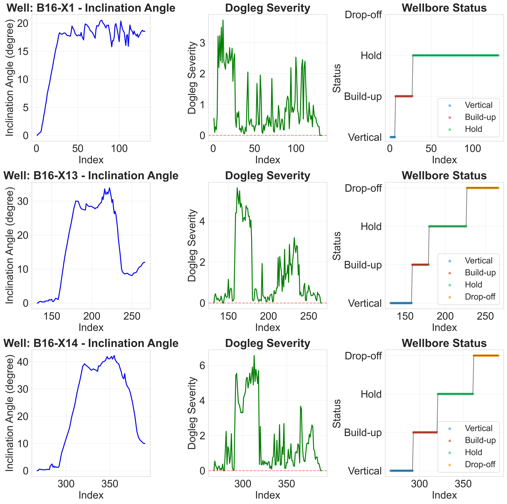
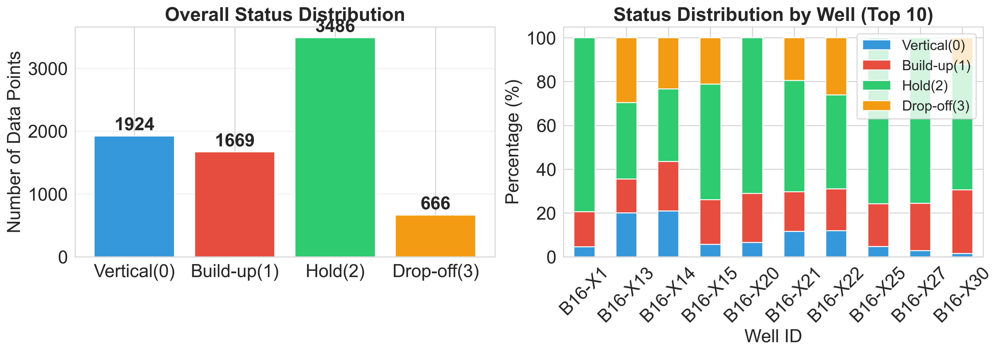
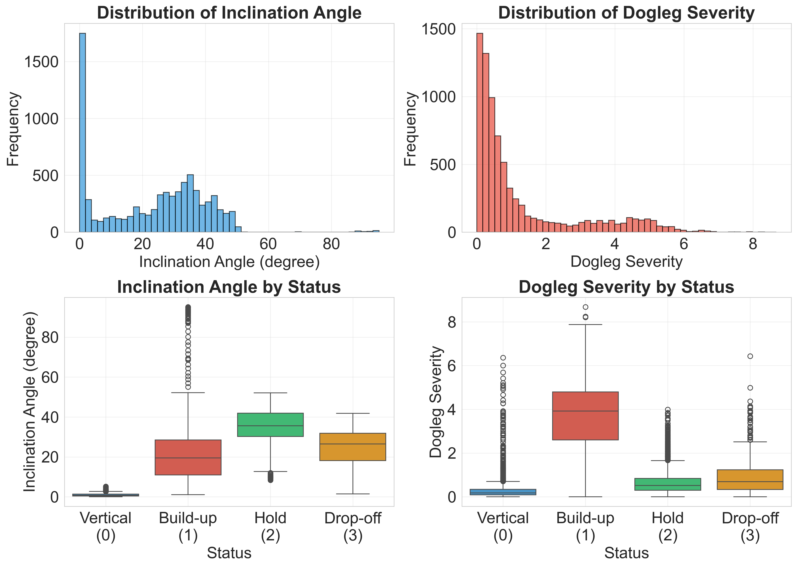
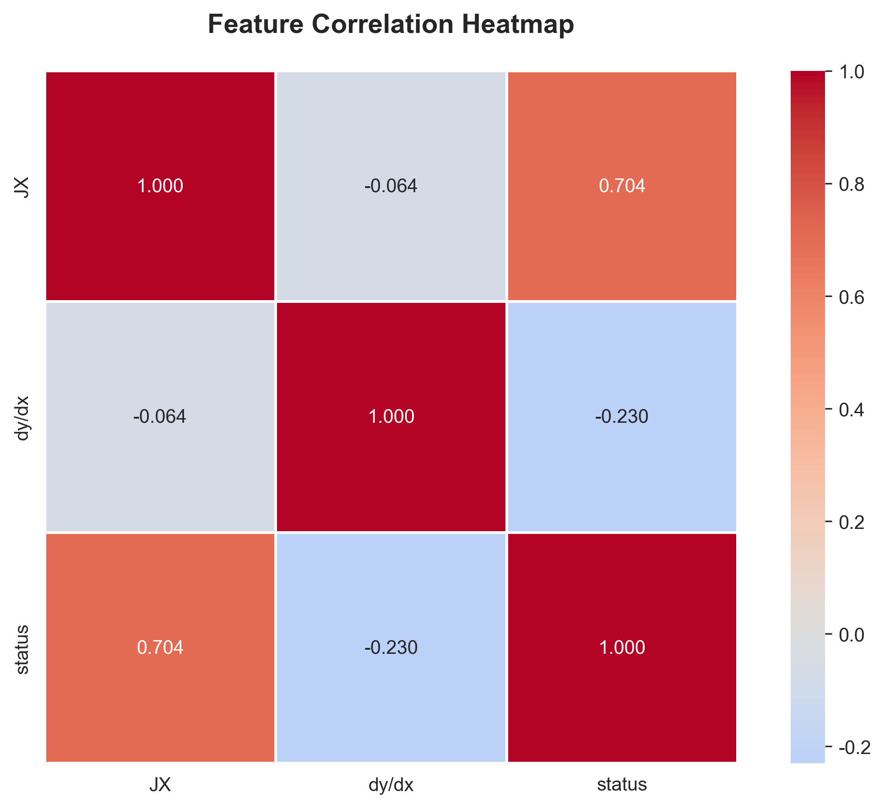

# Methodology

本章旨在详细阐述本研究提出的基于集成学习与规则修正的井眼轨迹状态识别框架，重点描述数据处理、特征工程构建、模型选择依据及核心的规则修正策略，以确保研究的可复现性 (Reproducibility)。

## 2.1 数据来源与预处理 (Data Acquisition and Preprocessing) 📂

### 2.1.1 数据来源与物理特性
本研究使用的数据集来源于真实的测井作业数据（经过脱敏处理）。数据主要包含以下关键物理量，它们反映了井眼轨迹的几何形态变化：
*   **井斜角 (Inclination, JX)**: 反映井眼偏离垂直方向的角度，是状态识别的最核心依据。
*   **狗腿度 (Dogleg Severity)**: 反映井眼轨迹弯曲变化的剧烈程度。
*   **深度序号 (Index)**: 随钻深度的时序标识。
*   **状态标签 (Status)**: 真实钻进状态，分为直井段(0)、造斜段(1)、稳斜段(2)和降斜段(3)。

图 2.1 展示了典型井眼的轨迹曲线及状态分布，直观反映了各物理量随深度的变化趋势。

*图 2.1: 典型井眼轨迹的物理量变化曲线（左：井斜角，中：狗腿度，右：钻进状态）*

### 2.1.2 数据预处理与数据集划分
为消除传感器噪声对模型的影响，我们采用以下预处理步骤：
1.  **数据清洗**: 将非数值型的异常记录（如“狗腿度”列中的无效字符）转换为数值或零值。
2.  **平滑降噪**: 采用 **Savitzky-Golay 滤波器** (Window=5, Poly=2) 或 **移动平均** (Rolling Mean) 对原始井斜角数据进行平滑处理，以保留趋势特征同时抑制高频噪声。
3.  **数据集划分**: 为了评估模型的泛化能力，我们按照**井号 (Well ID)** 进行随机划分，保证同一口井的数据不会同时出现在训练集和验证集中。
    *   **训练集 (Training Set)**: 80% 的井数据，用于模型参数学习。
    *   **验证集/测试集 (Validation/Test Set)**: 20% 的井数据，用于模型调优及性能评估。

图 2.2 展示了数据集中各状态的分布情况，可以看出不同状态之间存在样本不平衡现象（如直井段和稳斜段样本较多），这需要在后续模型训练中予以关注。

*图 2.2: 井眼轨迹状态的总体分布及各井分布情况*

## 2.2 特征工程体系 (Feature Engineering Framework) 🛠️

特征工程是提升模型性能的关键。我们构建了一个多视角的时序特征体系，共提取了约 28 维特征，旨在捕捉井眼轨迹的动态变化规律。

### 2.2.1 特征构建策略
特征构建主要围绕以下四个维度展开：

1.  **基础状态与位置特征 (Position & State View)**:
    *   **组内归一化 (Group-wise Norm)**: 计算当前点在整口井中的相对位置 (`rel_pos`) 和相对值 (`norm_value`)，消除不同井之间绝对深度的差异。
    *   **极值距离**: 计算当前井斜角距离该井最大井斜角的差值 (`dist_to_max`)，辅助判断是否处于稳斜段峰值区域。

2.  **速度与趋势特征 (Velocity & Trend View - 1st Derivative)**:
    *   **差分特征**: 一阶差分 (`diff_1`) 和三阶差分 (`diff_3`)，直接反映井斜变化率。
    *   **趋势斜率**: 计算过去 5 点和 10 点的线性回归斜率 (`trend_slope`)，量化局部造斜或降斜趋势。
    *   **连续升降计数**: 统计连续上升 (`consecutive_up`) 或下降 (`consecutive_down`) 的步数，捕捉持续的造斜或降斜行为。

3.  **拐点与加速度特征 (Inflection & Acceleration View - 2nd Derivative)**:
    *   **二阶差分**: (`diff_2`) 反映井斜变化率的变化，即“加速度”。
    *   **局部曲率 (Curvature)**: 基于微分几何公式计算的离散曲率，用于敏锐捕捉状态切换的拐点（如造斜结束转稳斜处）。

4.  **双向上下文特征 (Bi-directional Context View)**:
    *   **前瞻特征 (Look-ahead)**: 利用未来窗口的数据（如 `lead_slope_5`, `lead_diff_1`），捕捉“即将发生”的变化。这在离线处理或延迟允许的实时处理中极为有效。
    *   **前后比率**: 比较未来窗口均值与过去窗口均值的比率 (`pre_post_ratio`)，判断趋势是否发生反转。

图 2.3 和 图 2.4 分别展示了关键特征的分布特性及其相关性热力图，验证了特征对状态区分的有效性及特征间的非冗余性。

    
    

*图 2.3 (左): 关键特征的统计分布; 图 2.4 (右): 特征相关性热力图*

## 2.3 梯度提升集成模型 (Gradient Boosting Ensemble Models) 🤖

本研究采用基于决策树的梯度提升 (Gradient Boosting Decision Trees, GBDT) 算法族作为核心分类器。

### 2.3.1 模型选择
我们选取了业界最主流的四种集成模型进行实验与对比：
1.  **GBM (Gradient Boosting Machine)**: 基准模型，提供了稳健的梯度提升实现。
2.  **XGBoost**: 引入正则化项和二阶泰勒展开，具备极强的防过拟合能力和计算效率。
3.  **LightGBM**: 采用直方图算法和单边梯度采样 (GOSS)，在处理大规模表格数据时速度极快且精度高。
4.  **CatBoost**: 专为处理类别特征和有序数据优化，采用对称树结构和有序提升 (Ordered Boosting) 方法，能有效减少预测偏移，非常适合本任务中的时序特征。

选择这些模型的原因在于它们对**非线性关系**具有强大的拟合能力，且对表格数据（Tabular Data）的表现通常优于深度学习模型，同时具备良好的特征可解释性。

### 2.3.2 训练策略
*   **损失函数 (Loss Function)**: 采用多分类对数损失 (Multi-class Log Loss)，其公式如下：
    $$ L = - \frac{1}{N} \sum_{i=1}^{N} \sum_{c=0}^{M-1} y_{i,c} \log(p_{i,c}) $$
    其中 $N$ 为样本总数，$M$ 为类别数 (本任务中 $M=4$)，$y_{i,c}$ 是指示变量（若样本 $i$ 真实类别为 $c$ 则为 1，否则为 0），$p_{i,c}$ 是模型预测样本 $i$ 属于类别 $c$ 的概率（或置信度）。
    **为何关注置信度**: 对数损失函数的一个重要特性是它对**“自信但错误”**的预测给予极大的惩罚。通过最小化该损失，我们迫使模型输出**校准良好 (Well-calibrated)** 的概率分布，而不仅仅是硬分类结果。这意味着模型输出的概率值 $p_{i,c}$ 能真实反映预测的可信程度。这一特性至关重要，因为它为后续 **2.4 节中的规则修正策略** 提供了数学基础——即我们可以根据置信度高低来精准地判断哪些预测点是可以被修正的，哪些应当保留。
*   **类别平衡**: 针对状态分布不均问题，启用 `Auto Class Weights = Balanced` 或类似参数，自动调整样本权重。
*   **早停策略 (Early Stopping)**: 设置 `early_stopping_rounds=50`，即当验证集 Loss 在 50 轮内不再下降时停止训练，防止过拟合。

## 2.4 基于专家知识的规则修正策略 (Expert Rule-Based Correction Strategy) 🧠

虽然机器学习模型能捕捉复杂的统计规律，但在物理约束一致性上往往不如专家规则。为此，我们设计了独特的**“后处理规则修正模块”**，将物理约束注入模型预测结果中。

### 2.4.1 规则定义
我们定义了三条核心规则，按优先级依次应用：

**规则 1: 全局井型约束 (Global Well-Type Constraint)**
*   **物理意义**: 如果某口井的设计或实际轨迹显示其并未进入降斜阶段（例如该井最大状态仅为稳斜），则模型不应预测出“降斜”状态。
*   **逻辑**: 
    $$ \text{If } \max(S_{true}) < 3, \text{ then } \forall t, \hat{y}_t \leftarrow \min(\hat{y}_t, \max(S_{true})) $$
    *(注：此规则主要用于在已知井型先验知识的情况下的预测修正)*

**规则 2: 状态单调性约束 (Strict Monotonicity Constraint)**
*   **物理意义**: 正常的钻井工艺流程严格遵循 **直井段(0) $\to$ 造斜段(1) $\to$ 稳斜段(2) $\to$ 降斜段(3)** 的顺序，状态不可逆转（即深度增加时，状态值 $S_t$ 只能保持不变或增加）。
*   **逻辑**: 
    $$ S_{t+1} \ge S_t, \quad \forall t $$

**规则 3: 基于置信度的最小代价修正 (Confidence-Aware Minimum Cost Correction)**
*   **物理意义**: 当模型预测违反单调性时（例如出现了 1->2->1 的回退），我们需要修改序列使其单调。修改时，应优先保留模型**置信度 (Confidence)** 高的预测点，修改置信度低的点。
*   **算法实现**: 我们采用**动态规划 (Dynamic Programming)** 寻找全局最优的修正路径。

### 2.4.2 修正算法描述
定义 $DP[i][s]$ 为前 $i$ 个点修正为以状态 $s$ 结尾的最小代价。

**状态转移方程**:
$$ DP[i][s] = \min_{0 \le k \le s} (DP[i-1][k]) + \text{Cost}(i, s) $$

其中 $\text{Cost}(i, s)$ 为在时刻 $i$ 将状态修正为 $s$ 的代价：
$$ \text{Cost}(i, s) = \begin{cases} 
0 & \text{if } \hat{y}_i = s \\
1 + (1 - P(\hat{y}_i)) \times \lambda & \text{if } \hat{y}_i \ne s 
\end{cases} $$

*   $\hat{y}_i$: 原始模型在时刻 $i$ 的预测类别。
*   $P(\hat{y}_i)$: 模型预测该类别的置信度（概率）。
*   $\lambda$: 惩罚系数（例如 0.1），用于确保在修改次数相同时，优先修改置信度低的样本。

通过回溯 $DP$ 矩阵，我们可以得到满足物理约束且尽可能忠实于原始高置信度预测的最优状态序列。
